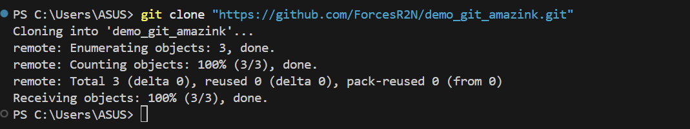
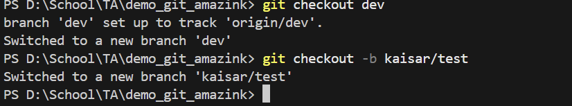
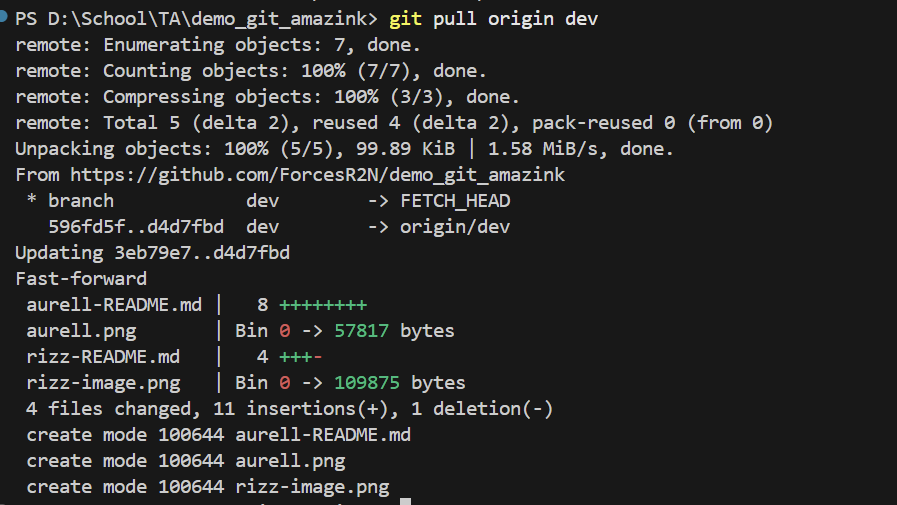
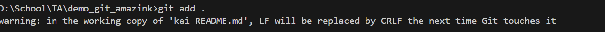
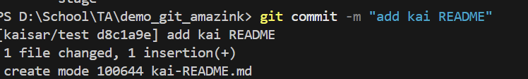
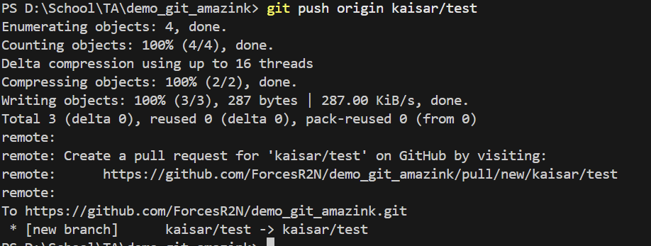

1. accapted invitation via email
2. clone repo with git clone "......."
   
3. git checkout to dev
4. git checkout -b for make a new branch
   
5. git pull origin dev to pull all changed in dev branch
   
6. make file what im working on
7. git add . for staged all changes
   
8. git commit -m "..." to give mesagges
   
9. git pull origin dev to make sure
10. git push origin dev
    
