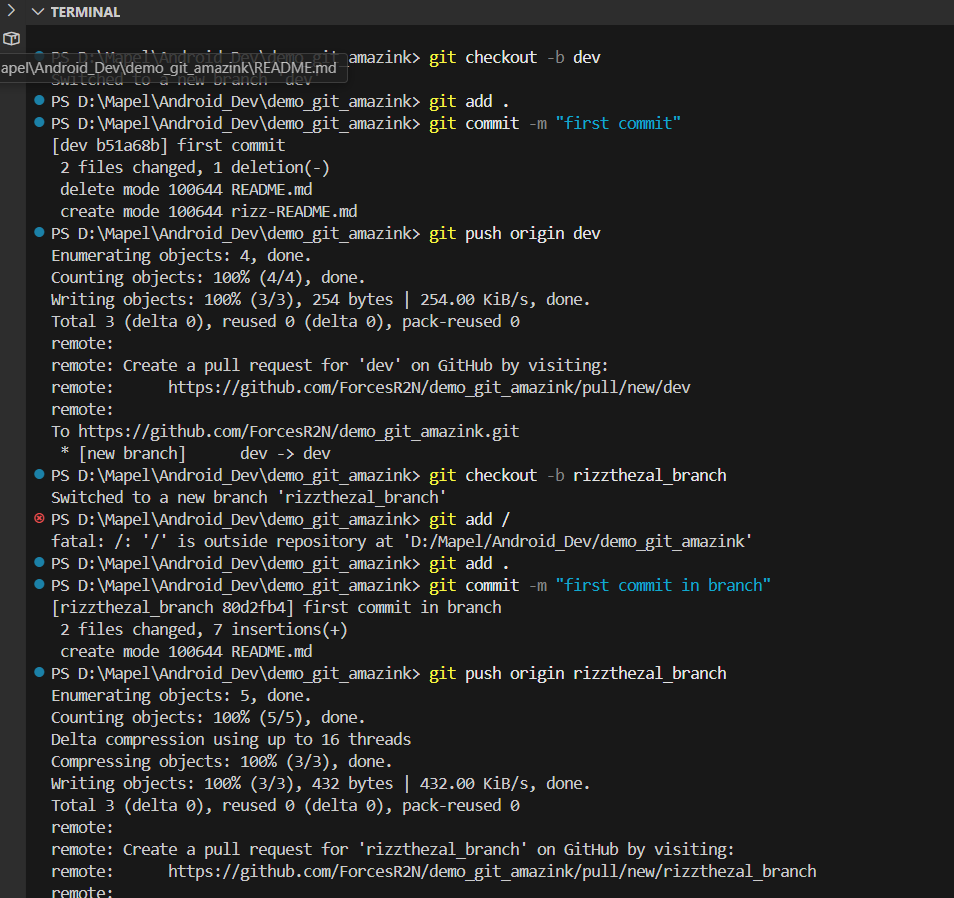

step 1: clone the repo from github (git clone)
step 2: git checkout -b <rizzthezal_branch>
step 3: make changes
step 4: git add .
step 5: git commit -m "ini message"
step 6: git push origin <rizzthezal_branch>
step 7: done bang

image: 

